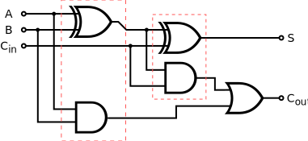

## VHDL File Structure

*[GPIO]: Genral purpose input output

The individual [files](https://github.com/djh1997/radar-work-experience/tree/main/fibb ) contain the building block for all the sub components.
  


  
```vhdl
LIBRARY ieee;
USE ieee.std_logic_1164.all;
USE ieee.std_logic_arith.all;
  
LIBRARY design_lib;
USE design_lib.ALL;
  
ENTITY halfadd IS
    PORT( 
        bit1, bit2	: IN    std_logic;
        sum, carry	: OUT   std_logic
    );
  
END halfadd ;
  
ARCHITECTURE halfadder OF halfadd IS
BEGIN
	sum <= bit1 XOR bit2;
	carry <= bit1 AND bit2;
END halfadder;
```  
  
The *architecture* code links individual *components* together into larger blocks of logic. using *internal signals* where necessary.
  
```vhdl
LIBRARY ieee;
USE ieee.std_logic_1164.all;
USE ieee.std_logic_arith.all;
  
LIBRARY design_lib;
USE design_lib.ALL;
  
ENTITY busadd IS
    PORT( 
        bit1    : IN    std_logic_vector(7 downto 0);
        bit2    : IN    std_logic_vector(7 downto 0);
        sum     : OUT   std_logic_vector(7 downto 0);
        carry   : OUT   std_logic
    );
  
END busadd ;
  
ARCHITECTURE busadder OF busadd IS
  
SIGNAL ha1carry_int : std_logic_vector(7 downto 0);
  
COMPONENT halfadder
    PORT (
        bit1    : IN    std_logic;
        bit2    : IN    std_logic;
        sum     : OUT   std_logic;
        carry   : OUT   std_logic
    );
END COMPONENT;
  
COMPONENT fulladder
    PORT (
        bit1    : IN    std_logic;
        bit2    : IN    std_logic;
        carryin : IN    std_logic;
        sum     : OUT   std_logic;
        carry   : OUT   std_logic
    );
END COMPONENT;
  
BEGIN
    I0 : halfadder
    PORT MAP (
        bit1    => bit1(0),
        bit2    => bit2(0),
        sum     => sum(0),
        carry   => ha1carry_int(0)
    );
  
    G1 : for i in 0 to 6 generate
        C1: fulladder
            port map (
                bit1    => bit1(i+1),
                bit2    => bit2(i+1),
                carryin => ha1carry_int(i),
                sum     => sum(i+1),
                carry   => ha1carry_int(i+1)
            );
    end generate;
    carry <= ha1carry_int(7);
END busadder;
```  
  
Then there is the GPIO test bench to run a simulation of the code.
  
```vhdl
LIBRARY IEEE;
USE IEEE.STD_LOGIC_1164.ALL;
USE IEEE.NUMERIC_STD.ALL;
  
--! Local libraries
  
LIBRARY design_lib;
USE design_lib.ALL;
  
--! ENTITY/Package Description
ENTITY GPIO_Test is
END ENTITY GPIO_Test;
  
architecture tb of GPIO_Test is
  
	SIGNAL	done	:	STD_LOGIC;
	SIGNAL	clk		:	STD_LOGIC;
  
begin
  
 --! Port map declaration for
	UUT : ENTITY design_lib.fibber
		port map (
			done	=> done,
			clk		=> clk_system,
		);
  
    Clk: PROCESS is
    begin
  
        while now <= 500*clk_speed loop
  
            clk_system <= '0';
            wait for clk_speed/2;
            clk_system <= '1';
            wait for clk_speed/2;
  
        END loop;
  
        wait;
    END PROCESS;
  
END architecture tb;
```  
  