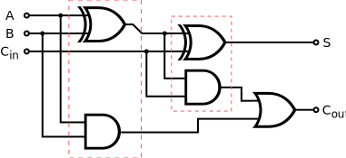

# Logic gates

## Buffer

A digital buffer is an electronic circuit element used to isolate an input from an output. The buffer's output state mirrors the input state.

| Input | Output |
| ----- | ------ |
| A     | Q      |
| 0     | 0      |
| 1     | 1      |

---

## Not

An inverter or NOT gate is a logic gate which implements logical negation. It outputs a bit opposite of the bit that is put into it.

| Input | Output |
| ----- | ------ |
| A     | Q      |
| 0     | 1      |
| 1     | 0      |

---

## And

The AND gate is a basic digital logic gate that implements logical conjunction. A HIGH output (1) results only if all the inputs to the AND gate are HIGH (1). If not all inputs to the AND gate are HIGH, LOW output results.

| Input1 | Input2 | Output |
| ------ | ------ | ------ |
| A      | B      | Q      |
| 0      | 0      | 0      |
| 0      | 1      | 0      |
| 1      | 0      | 0      |
| 1      | 1      | 1      |

---

## Or

The OR gate is a digital logic gate that implements logical disjunction. It outputs a 1 if any inputs are 1, or outputs a 0 only if all inputs are 0.

| Input1 | Input2 | Output |
| ------ | ------ | ------ |
| A      | B      | Q      |
| 0      | 0      | 0      |
| 0      | 1      | 1      |
| 1      | 0      | 1      |
| 1      | 1      | 1      |

---

## Nand

A NAND gate (NOT-AND) is a logic gate which produces an output which is false only if all its inputs are true; thus its output is complement to that of an AND gate.

| Input1 | Input2 | Output |
| ------ | ------ | ------ |
| A      | B      | Q      |
| 0      | 0      | 1      |
| 0      | 1      | 1      |
| 1      | 0      | 1      |
| 1      | 1      | 0      |

---

## Nor

The NOR gate is a digital logic gate which produces A HIGH output (1) result if both the inputs to the gate are LOW (0) if one or both input is HIGH (1), a LOW output (0) results.; thus its output is complement to that of an OR gate.

| Input1 | Input2 | Output |
| ------ | ------ | ------ |
| A      | B      | Q      |
| 0      | 0      | 1      |
| 0      | 1      | 0      |
| 1      | 0      | 0      |
| 1      | 1      | 0      |

---

## Xor

XOR gate is a digital logic gate that gives a true (1 or HIGH) output when the number of true inputs is odd. An XOR gate implements an exclusive or ; that is, a true output results if one, and only one, of the inputs to the gate is true. If both inputs are false (0/LOW) or both are true, a false output results.

| Input1 | Input2 | Output |
| ------ | ------ | ------ |
| A      | B      | Q      |
| 0      | 0      | 0      |
| 0      | 1      | 1      |
| 1      | 0      | 1      |
| 1      | 1      | 0      |

---

## Xnor

The XNOR gate is a digital logic gate whose function is the logical complement of the Exclusive OR (XOR) gate.

| Input1 | Input2 | Output |
| ------ | ------ | ------ |
| A      | B      | Q      |
| 0      | 0      | 1      |
| 0      | 1      | 0      |
| 1      | 0      | 0      |
| 1      | 1      | 1      |

---

## Half adder

| Input |     | Output |       |
| ----- | --- | ------ | ----- |
| A     | B   | sum    | carry |
| 0     | 0   | 0      | 0     |
| 0     | 1   | 1      | 0     |
| 1     | 0   | 1      | 0     |
| 1     | 1   | 0      | 1     |

---

## Adder

| Input |     |          | Output |       |
| ----- | --- | -------- | ------ | ----- |
| A     | B   | carry in | sum    | carry |
| 0     | 0   | 0        | 0      | 0     |
| 0     | 0   | 1        | 1      | 0     |
| 0     | 1   | 0        | 1      | 0     |
| 0     | 1   | 1        | 0      | 1     |
| 1     | 0   | 0        | 1      | 0     |
| 1     | 0   | 1        | 1      | 0     |
| 1     | 1   | 0        | 0      | 1     |
| 1     | 1   | 1        | 1      | 1     |
