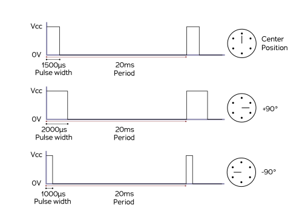

# Worksheet

For the hands-on activity you will be making your own electronic circuits and making the code to run them.
You may have already done some electronics at school; if you have you will recognise some of the symbols below.


The first activity is to understand how these symbols and pictures relate to electronic components, and how by connecting them together they can show us how to build a circuit from scratch.

In the circuit diagram, the Arduino micro-controller will be shown as a box with information written in it.


The lines coming from the Arduino box represent pins on the board where wires and components can be connected.

There are 3 main types of pins to look for.  

- The ones labelled with **A** and a number are Analogue pins.
- The ones labelled **D** and a number are Digital Pins.
- The ones with other labels like **5v** and **Gnd** are the other connections to the board, like power.

## C language

C was developed in 1972
C source text is free-format, using the semicolon as a statement terminator and curly braces for grouping blocks of statements.

```c
const int ledpin = 10;

void setup() {
  pinMode(ledpin, OUTPUT);
 }

void loop(){
   digitalWrite(ledpin, HIGH); 
   delay(1000); 
   digitalWrite(ledpin, LOW); 
   delay(1000);
}
```

- There is a small number of keywords; if/else, for, do/while, while, and switch. User-defined names are not distinguished from keywords by any kind of sigil.
- There are a large number of arithmetic, bitwise and logic operators: +, +=, ++, &, ||
- More than one assignment may be performed in a single statement.
- Typing is static, but weakly enforced; all data has a type, but implicit conversions are possible.
- User-defined types are possible.
- Array indexing is a secondary notation, defined in terms of pointer arithmetic. There is no "array" keyword in use or definition; instead, square brackets indicate arrays syntactically, for example month[11].
- Low-level access to computer memory is possible by converting machine addresses to typed pointers.
- There is a basic form of modularity: files can be compiled separately and linked together, with control over which functions and data objects are visible to other files via static and extern attributes.

C is the primary language for embedded systems since it offers low level code instructions and is efficient if written properly.
C can run on most major platforms from microcontrollers like Arduino to single board computers like raspberry pi’s all the way up to the word most powerful super computer.

## Sonar


This is the ultra-sonic sensor that we will be using, the way these work is by sending out a pulse of sound and waiting to the echo to come back.

The way you trigger the ultrasonic sensor is by setting the trig pin high for 10 µs
To get the time of flight you time the length of a high pulse received from the echo pin
It is then possible to calculate the distance by using the time of flight. Tinkercad design [^1]

**Distance = time of flight x speed of sound / 2**

**The speed of sound in air: 343m/s = 0.0343 cm/µs**

```c
  digitalWrite(trigPin, HIGH);  // set trig pin high
  delayMicroseconds(10); //wait for 10 µs
  digitalWrite(trigPin, LOW); //set trig pin low again
  duration = pulseIn(echoPin, HIGH); // get the time of flight
  distance= duration*0.0343/2;
```

## Servo



The next component we will be adding is a servo. A servo is a geared motor with feedback, this means that we can send it a position and it will turn to that position. Simulation

The signal we need to send is a square wave similar to PWM. Each cycle in the signal lasts for 20 milliseconds and for most of the time, the value is LOW. At the beginning of each cycle, the signal is HIGH for a time between 1 and 2 milliseconds. At 1 millisecond it represents 0 degrees and at 2 milliseconds it represents 180^o^ degrees.

For controlling the servo there is a library that deals with setting up the PWM signal so all we need to do is tell the library which pin the servo is connected to and then what position we want.Tinkercad design [^2]

```c
#include <Servo.h>
Servo myServo;
Void setup(){myServo.attach(12);}
Void loop(){
    for(int i=0;i<=180;i++){
        myServo.write(i);
        delay(1000);
    }
}
```

## Addressable LED’s

To display the distance to the nearest object we will be using a strip of addressable LED’s.
Addressable LEDS have a tiny microcontroller on each of the LEDs to allow each one to light up with a unique colour and brightness.  The strips have a positive voltage wire, a ground, and a data wire.  Each time the data reaches an LED it is read and passed down the strip to the next led. First chip reads the incoming address as LED 0, and then performs the instructions for LED 0; it also passes the data on to the next chip after increasing the counter value by 1.  In other words, the first LED says “*Okay, I’m LED 0, the next LED to get this message is LED 1*”; this message continues down the strip until there are no more LEDS left.  The important thing for you to know here is that each LED in the strip needs to be given specific instructions with their specific address.

- The LED’s we are using is Adafruit’s NeoPixel these are 5v addressable led.

- Each led has 4 connections these being:
- Data in from the micro controller for the first led or the previous led for the rest.
- 5v for power
- Ground
- Data out which passes the data along to the next led.

Since the timing on these is even more complicated than the servo there is another library that we can use. All we need to know is what pin the led are connected to and how many we are using, then we can tell the library what number led we want to change and the RGB (colour) we want.

```c
#include <Adafruit_NeoPixel.h>
#define LED_PIN    6
#define LED_COUNT 8
Adafruit_NeoPixel strip(LED_COUNT, LED_PIN);
void setup() {
  strip.begin();
  strip.show(); // Initialize all pixels to 'off'
}
Void loop(){
 strip.setPixelColor(pixel number,R,G,B);
 strip.show();
}
```

## Final project


 The final project is going to be combing all thee into one part that can be used to monitor the distance to nearby object in a 160^o^ degrees and display the distance on the led strip using with green being clear going to red as the object gets closer. Tinkercad design [^3]

Design link
[^1]: [Ultrasonic](https://www.tinkercad.com/things/2m9z7J7ilNz)
[^2]: [Servo](https://www.tinkercad.com/things/jJ56Dm6xdup)
[^3]: [sonar](https://www.tinkercad.com/things/jVeZ0btGQeu)
