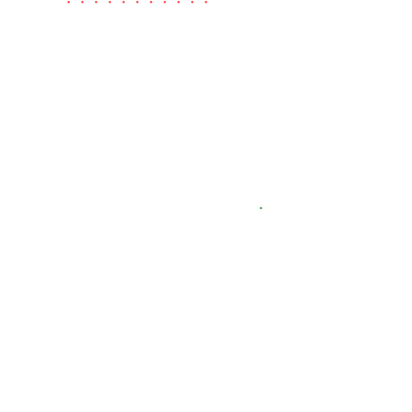

# Radar work experience

*[VHDL]:VHSIC Hardware Description Language
*[VHSIC]:Very High Speed IC
*[IC]:Integrated Circuit
*[PLD]: Programmable Logic Device
*[SPLD]: Simple Programmable Logic Devices
*[GAL]: Generic Array Logic
*[CPLD]: Complex Programmable Logic Devices
*[FPGA]: Field Programmable Gate Array
*[ASIC]: Application Specific Integrated Circuit
*[US DOD]: United States Department of Defense



## VHDL

VHDL is a language that is used to describe the layout of the a PLD

There is a hierarchy of PLD's

- SPLD
- GAL
- CPLD
- FPGA

FPGA's are used for low production runs and high modifiability for future updates. Another use case is during the development of ASIC to reduce the prototyping cycle time.

They have their roots in a [US DOD project](https://en.wikipedia.org/wiki/Very_High_Speed_Integrated_Circuit_Program) from the early 1980s.

## Logic gates

### Buffer

A digital buffer is an electronic circuit element used to isolate an input from an output. The buffer's output state mirrors the input state.


| Input | Output                  |
| ----- | ----------------------- |
| A     | Q                       |
| 0     | <input type="checkbox"> |
| 1     | <input type="checkbox"> |

---

### Not

An inverter or NOT gate is a logic gate which implements logical negation. It outputs a bit opposite of the bit that is put into it.


| Input | Output                  |
| ----- | ----------------------- |
| A     | Q                       |
| 0     | <input type="checkbox"> |
| 1     | <input type="checkbox"> |

---

### And

The AND gate is a basic digital logic gate that implements logical conjunction. A HIGH output (1) results only if all the inputs to the AND gate are HIGH (1). If not all inputs to the AND gate are HIGH, LOW output results.


| Input1 | Input2 | Output                  |
| ------ | ------ | ----------------------- |
| A      | B      | Q                       |
| 0      | 0      | <input type="checkbox"> |
| 0      | 1      | <input type="checkbox"> |
| 1      | 0      | <input type="checkbox"> |
| 1      | 1      | <input type="checkbox"> |

---

### Or

The OR gate is a digital logic gate that implements logical disjunction. It outputs a 1 if any inputs are 1, or outputs a 0 only if all inputs are 0.


| Input1 | Input2 | Output                  |
| ------ | ------ | ----------------------- |
| A      | B      | Q                       |
| 0      | 0      | <input type="checkbox"> |
| 0      | 1      | <input type="checkbox"> |
| 1      | 0      | <input type="checkbox"> |
| 1      | 1      | <input type="checkbox"> |

---

### Nand

A NAND gate (NOT-AND) is a logic gate which produces an output which is false only if all its inputs are true; thus its output is complement to that of an AND gate.


| Input1 | Input2 | Output                  |
| ------ | ------ | ----------------------- |
| A      | B      | Q                       |
| 0      | 0      | <input type="checkbox"> |
| 0      | 1      | <input type="checkbox"> |
| 1      | 0      | <input type="checkbox"> |
| 1      | 1      | <input type="checkbox"> |

---

### Nor

The NOR gate is a digital logic gate which produces A HIGH output (1) result if both the inputs to the gate are LOW (0) if one or both input is HIGH (1), a LOW output (0) results.; thus its output is complement to that of an OR gate.


| Input1 | Input2 | Output                  |
| ------ | ------ | ----------------------- |
| A      | B      | Q                       |
| 0      | 0      | <input type="checkbox"> |
| 0      | 1      | <input type="checkbox"> |
| 1      | 0      | <input type="checkbox"> |
| 1      | 1      | <input type="checkbox"> |

---

### Xor

XOR gate is a digital logic gate that gives a true (1 or HIGH) output when the number of true inputs is odd. An XOR gate implements an exclusive or ; that is, a true output results if one, and only one, of the inputs to the gate is true. If both inputs are false (0/LOW) or both are true, a false output results.


| Input1 | Input2 | Output                  |
| ------ | ------ | ----------------------- |
| A      | B      | Q                       |
| 0      | 0      | <input type="checkbox"> |
| 0      | 1      | <input type="checkbox"> |
| 1      | 0      | <input type="checkbox"> |
| 1      | 1      | <input type="checkbox"> |

---

### Xnor

The XNOR gate is a digital logic gate whose function is the logical complement of the Exclusive OR (XOR) gate.


| Input1 | Input2 | Output                  |
| ------ | ------ | ----------------------- |
| A      | B      | Q                       |
| 0      | 0      | <input type="checkbox"> |
| 0      | 1      | <input type="checkbox"> |
| 1      | 0      | <input type="checkbox"> |
| 1      | 1      | <input type="checkbox"> |

---

### Half adder


| Input |     | Output                  |                         |
| ----- | --- | ----------------------- | ----------------------- |
| A     | B   | sum                     | carry                   |
| 0     | 0   | <input type="checkbox"> | <input type="checkbox"> |
| 0     | 1   | <input type="checkbox"> | <input type="checkbox"> |
| 1     | 0   | <input type="checkbox"> | <input type="checkbox"> |
| 1     | 1   | <input type="checkbox"> | <input type="checkbox"> |

---

### Adder


| Input |     |          | Output                  |                         |
| ----- | --- | -------- | ----------------------- | ----------------------- |
| A     | B   | carry in | sum                     | carry                   |
| 0     | 0   | 0        | <input type="checkbox"> | <input type="checkbox"> |
| 0     | 0   | 1        | <input type="checkbox"> | <input type="checkbox"> |
| 0     | 1   | 0        | <input type="checkbox"> | <input type="checkbox"> |
| 0     | 1   | 1        | <input type="checkbox"> | <input type="checkbox"> |
| 1     | 0   | 0        | <input type="checkbox"> | <input type="checkbox"> |
| 1     | 0   | 1        | <input type="checkbox"> | <input type="checkbox"> |
| 1     | 1   | 0        | <input type="checkbox"> | <input type="checkbox"> |
| 1     | 1   | 1        | <input type="checkbox"> | <input type="checkbox"> |

## Binary

### Counting

Counting in binary can seem a bit daunting but it not really any different to normal decimal counting.

When you were first learning numbers you'd have been taught about the unit's ten's hundred's columns system.

| hundred's | ten's | unit's |
| --------- | ----- | ------ |
| 1         | 0     | 5      |

Binary is basically the same but instead of have multiple options (0 up to 9 in binary) it on has 2 so each column is basically a tick box for is value.
The values go up in multiples of 2 e.g. 1,2,4,8,16,32,64,128,256,1024,2048...

To convert a number from decimal to binary you can:

- pick the biggest numbers in the table that is smaller than the number your converting and put a 1 in that column.
- then take that number away from your original for example 105-64=41
- repeat this until you reach 0

| 128's | 64's | 32's | 16's | 8's | 4's | 2's | 1's |
| ----- | ---- | ---- | ---- | --- | --- | --- | --- |
| 0     | 1    | 1    | 0    | 1   | 0   | 0   | 1   |

If you add up the values with 1 in there column 1+8+32+64 you get 105

### Addition

Likely the first way you'd have learnt addition would have been column addition for any non single digit numbers

For example if we wanted to add 105 and 27 we'd end up with a table that looked some thing like this.

|     | hundred's | ten's | unit's |
| --- | --------- | ----- | ------ |
|     | 1         | 0     | 5      |
| +   |           | 2~1~  | 7      |
|     | 1         | 3     | 2      |

Whereas in binary we only have 2 options.

|     | 128's | 64's | 32's | 16's | 8's | 4's  | 2's  | 1's |
| --- | ----- | ---- | ---- | ---- | --- | ---- | ---- | --- |
|     | 0     | 1    | 1    | 0    | 1   | 0    | 0    | 1   |
|     | 0~1~  | 0~1~ | 0~1~ | 1~1~ | 1   | 0~1~ | 1~1~ | 1   |
|     | 1     | 0    | 0    | 0    | 0   | 1    | 0    | 0   |

As you can see the ripple of carrying the 1 up moves a lot further in binary than it does in decimal.

## VHDL files

The individual [files](https://github.com/djh1997/radar-work-experience/tree/main/fibb) contain the building block for all the sub components.


```vhdl
LIBRARY ieee;
USE ieee.std_logic_1164.all;
USE ieee.std_logic_arith.all;

LIBRARY design_lib;
USE design_lib.ALL;

ENTITY halfadd IS
    PORT(
        bit1, bit2	: IN    std_logic;
        sum, carry	: OUT   std_logic
    );

END halfadd ;

ARCHITECTURE halfadder OF halfadd IS
BEGIN
	sum <= bit1 XOR bit2;
	carry <= bit1 AND bit2;
END halfadder;
```

The architecture code link them together into larger blocks of logic. using internal signals where necessary.

```vhdl
LIBRARY ieee;
USE ieee.std_logic_1164.all;
USE ieee.std_logic_arith.all;

LIBRARY design_lib;
USE design_lib.ALL;

ENTITY busadd IS
    PORT(
        bit1    : IN    std_logic_vector(7 downto 0);
        bit2    : IN    std_logic_vector(7 downto 0);
        sum     : OUT   std_logic_vector(7 downto 0);
        carry   : OUT   std_logic
    );

END busadd ;

ARCHITECTURE busadder OF busadd IS

SIGNAL ha1carry_int : std_logic_vector(7 downto 0);

COMPONENT halfadder
    PORT (
        bit1    : IN    std_logic;
        bit2    : IN    std_logic;
        sum     : OUT   std_logic;
        carry   : OUT   std_logic
    );
END COMPONENT;

COMPONENT fulladder
    PORT (
        bit1    : IN    std_logic;
        bit2    : IN    std_logic;
        carryin : IN    std_logic;
        sum     : OUT   std_logic;
        carry   : OUT   std_logic
    );
END COMPONENT;

BEGIN
    I0 : halfadder
    PORT MAP (
        bit1    => bit1(0),
        bit2    => bit2(0),
        sum     => sum(0),
        carry   => ha1carry_int(0)
    );

    G1 : for i in 0 to 6 generate
        C1: fulladder
            port map (
                bit1    => bit1(i+1),
                bit2    => bit2(i+1),
                carryin => ha1carry_int(i),
                sum     => sum(i+1),
                carry   => ha1carry_int(i+1)
            );
    end generate;
    carry <= ha1carry_int(7);
END busadder;
```

Then there is the GPIO test bench to run a simulation of the code.

```vhdl
LIBRARY IEEE;
USE IEEE.STD_LOGIC_1164.ALL;
USE IEEE.NUMERIC_STD.ALL;

--! Local libraries

LIBRARY design_lib;
USE design_lib.ALL;

--! ENTITY/Package Description
ENTITY GPIO_Test is
END ENTITY GPIO_Test;

architecture tb of GPIO_Test is

	SIGNAL	done	:	STD_LOGIC;
	SIGNAL	clk		:	STD_LOGIC;

begin

 --! Port map declaration for
	UUT : ENTITY design_lib.fibber
		port map (
			done	=> done,
			clk		=> clk_system,
		);

    Clk: PROCESS is
    begin

        while now <= 500*clk_speed loop

            clk_system <= '0';
            wait for clk_speed/2;
            clk_system <= '1';
            wait for clk_speed/2;

        END loop;

        wait;
    END PROCESS;

END architecture tb;
```
